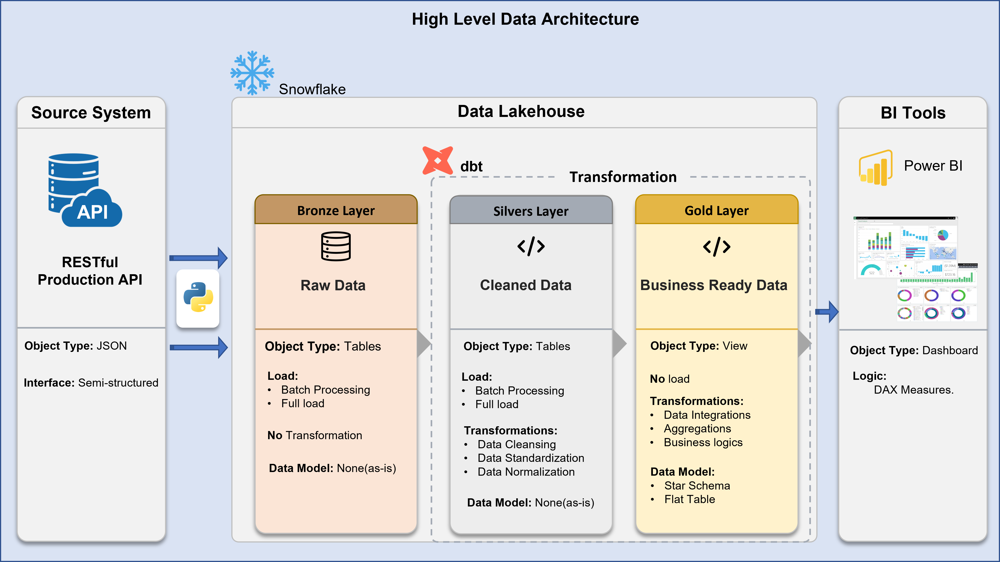

# E-Commerce Analytics Warehouse

## Overview

This project demonstrates an end-to-end modern data pipeline that automates Customer Lifetime Value (CLV) calculations. The pipeline extracts data from a custom API, loads it into Snowflake, transforms it using dbt with a Medallion architecture, and delivers insights through Power BI dashboards.

The solution replaces a manual spreadsheet-based workflow with a scalable and automated cloud analytics system.

## Business Problem

Customer Lifetime Value (CLV) was calculated manually each week using spreadsheets. This process:

- Took approximately 4 hours weekly
- Required manual data preparation
- Introduced calculation inconsistencies
- Delayed business decision-making

The organization needed a centralized and automated solution to improve efficiency and accuracy.

## Solution Overview

An automated end-to-end data pipeline was designed to:

- Extract data from a custom API using Python
- Load raw data into Snowflake (Bronze layer)
- Transform data using dbt (Silver & Gold layers)
- Apply data quality tests
- Deliver insights through Power BI dashboards

## Architecture



## Tech Stack

- **Python** — Data extraction & loading
- **Snowflake** — Cloud data warehouse
- **dbt** — Data transformation & testing
- **Power BI** — Data visualization
- **Medallion Architecture** — Bronze, Silver, Gold layers

## Data Lineage

*[Data Lineage Diagram – insert your image here]*

## Key Features

- Automated end-to-end pipeline
- Medallion architecture implementation
- dbt transformation framework
- Data quality testing with dbt
- Centralized Snowflake warehouse
- Business-ready Gold layer
- Interactive Power BI dashboard
- Scalable cloud architecture

## Business Impact

- Reduced manual work from 4 hours to 0
- Improved data accuracy by 25%
- Fully automated CLV calculations
- Enabled real-time business insights
- Centralized analytics warehouse

## Project Summary

Built a centralized Snowflake warehouse that automated CLV calculations, replacing a 4-hour manual weekly process. Reduced manual effort by 100% and improved accuracy by 25%.

## Project Structure
```
ecommerce_analytics_warehouse/
├── scripts/ # Extraction & Loading Layer
│ ├── Extract_and_Load_to_Snowflake.py
│ └── mock_api.py # Simulates the source API with messy data
├── dbt_migration/ # Transformation Layer
│ ├── models/
│ │ ├── intermediate/ # Silver Layer: Cleaning & Macros
│ │ └── marts/ # Gold Layer: Star Schema/Dimensions
│ ├── snapshots/ # SCD Type 2 Historical tracking (if needed)
│ ├── dbt_project.yml
│ └── profiles.yml
├── init_snowflake_datawarehouse.sql # Snowflake setup script
└── README.md # Project documentation
```
